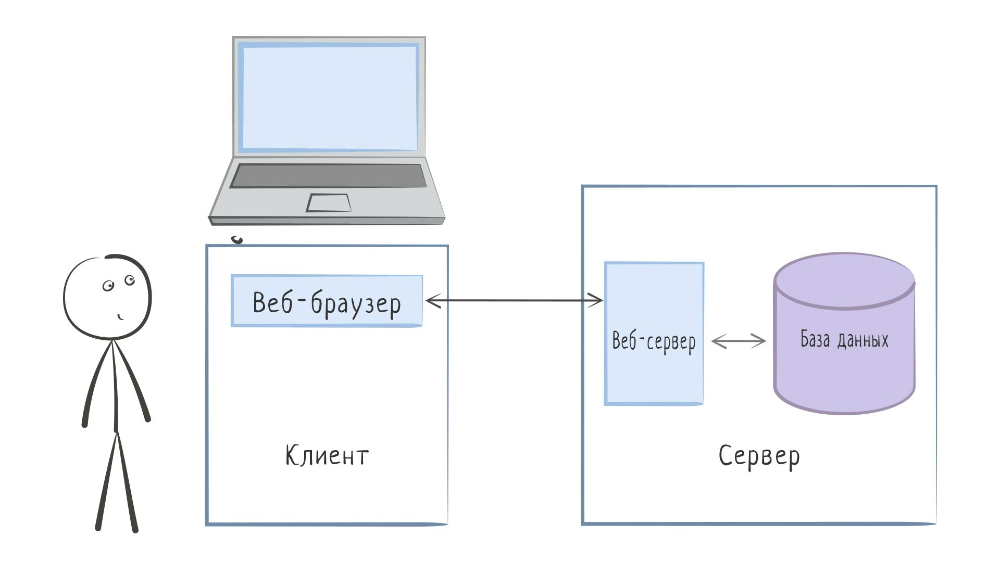

Введение—
Основы реляционных баз данных

Любая нетривиальная программная система состоит минимум из двух компонентов:

Программного кода, отвечающего за логику работы
Хранилища, в котором содержатся данные, необходимые для работы
Возьмем для примера Хекслет. Это большой контентный проект, внутри которого есть данные: например, курсы и их содержимое.

Более того, довольно много контента создается самими пользователями: они вводят данные при регистрации, создают и заполняют профиля пользователя, описывают свои решения и переписываются с поддержкой через топики. Все эти данные непрерывно добавляются на сайт и только увеличиваются в объемах.

При этом данные нужно не только хранить, но и непрерывно считывать и показывать пользователям. Причем иногда в довольно хитрых формах, например: «Показать на странице испытания три последних код-ревью по этому испытанию, исключая код-ревью пользователя, который прямо сейчас смотрит на эту страницу».

Подобные сложные запросы к системе хранения делаются ежесекундно, и многие из них значительно сложнее приведенного примера.

Кроме того, пользователи на сайтах работают независимо друг от друга, что создает конкуренцию при обращении к одним и тем же данным. А что, если один пользователь читает данные, которые в это время модифицируются другим пользователем?

За реализацию всех этих возможностей отвечают системы управления базами данных (СУБД). Как правило, они отвязаны от того языка программирования, на котором идет разработка. СУБД — это отдельная программа, которая умеет эффективно сохранять и читать то, что ее попросят.

Таких систем существует довольно много, но это не значит, что все они абсолютно разные. Схожие системы делят на классы — множества систем со схожими характеристиками.

Чаще всего используются реляционные СУБД (РСУБД) — системы, работа которых основана на реляционной модели данных. С технической точки зрения такие базы данных основаны на табличном представлении данных.

Для работы с ними нужно понимать две основные вещи:

Реляционную модель данных — звучит страшно, но в итоге все сводится к таблицам
SQL — специализированный язык для управления базой данных и данными внутри нее
Оба пункта практически не зависят от реализации конкретной РСУБД. Изучив одну СУБД, вы крайне легко сможете переключиться на другую.

Основные темы курса
В этом курсе мы рассмотрим популярную СУБД PostgreSQL и затронем такие основные темы:

Установка и настройка
Создание и модификация базы данных (DDL)
Наполнение базы данных (DML)
Выборка данных (SELECT, WHERE, ORDER, LIMIT, DISTINCT, GROUP, HAVING)
Агрегирующие функции (COUNT)
Соединения (JOIN, LEFT JOIN)
Транзакции (уровни изоляции)
Реляционная алгебра (основы теории множеств)
Ключи (первичные, внешние)
Нормализация данных
Связи (один-к-одному, один-ко-многим, многие-ко-многим)
Производительность (индексы)
Как подготовиться к этому курсу
Чтобы пройти этот курс, достаточно уметь работать с командной строкой. Изучить эту тему вы можете в нашем курсе Основы командной строки.

Аватары экспертов Хекслета
Остались вопросы? Задайте их в разделе «Обсуждение»
Вам ответят команда поддержки Хекслета или другие студенты.

Об обучении на Хекслете
Статья «Как учиться и справляться с негативными мыслями»
Статья «Ловушки обучения»
Статья «Сложные простые задачи по программированию»
Урок «Как эффективно учиться на Хекслете»
Вебинар «Как самостоятельно учиться»