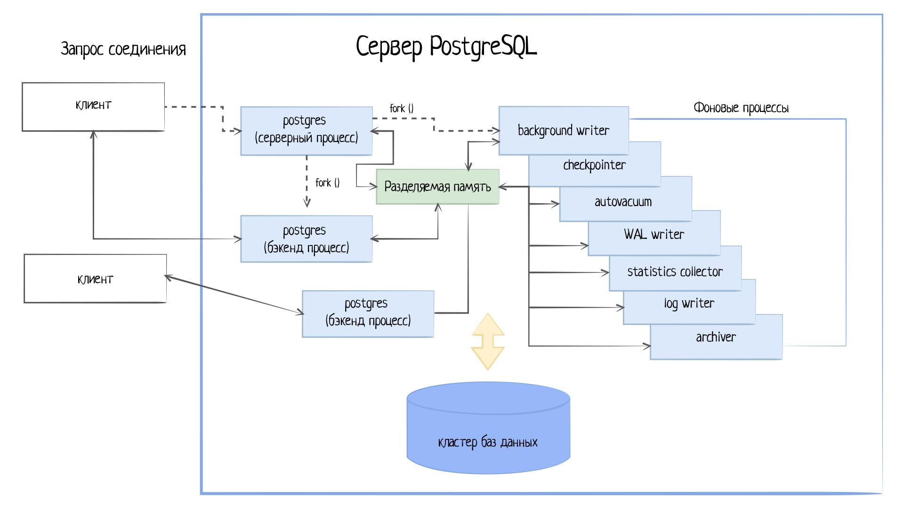

Архитектура СУБД—
Основы реляционных баз данных

Зачем нужны базы данных? Данные, с которыми работают программы, не существуют сами по себе: их нужно как-то хранить, уметь добавлять, извлекать, читать, обновлять и удалять. Все эти действия было бы сложно проводить, если бы базы данных не имели бы конкретной продуманной структуры.

В этом уроке мы изучим подробнее архитектуру баз данных, чтобы лучше представлять себе то, с чем предстоит работать далее в курсе.

Почему у СУБД сложная архитектура
Когда компьютеры только появились, задачу хранения данных каждый решал по-своему. Самый простой способ хранить данные — положить их в файл. Но тогда неизбежно встанут вопросы:

Как потом найти эти данные?
А если разные данные имеют разную структуру и разный размер?
А что, если данные понадобятся нескольким пользователям одновременно?
А что, если во время обновления произойдет сбой?
А если данных станет настолько много, что они не поместятся в один файл?
Именно из-за этих вопросов разработка систем хранения — очень сложная и затратная история. Инженеры довольно быстро поняли, что базами данных должна заниматься специализированная программа, функционирующая независимо от софта, который они разрабатывают.

СУБД — невероятно сложные программы, к которым предъявляются практически максимальные требования по надежности, скорости работы и эффективности. Неспроста считается, что если базе данных меньше 10 лет, то это слишком молодой продукт для использования в серьезных приложениях.

Как устроены СУБД
СУБД реализуется как клиент-серверное приложение:

Сервером выступает сама СУБД — она управляет файлами баз данных, принимает запросы от клиентов и выполняет их команды
Клиентом считается любое приложение, желающее взаимодействовать с базой данных.
Клиентские приложения могут быть разнообразны по форме:

Текстовая утилита
Графическое приложение
Веб-сервер, использующий базу данных для отображения веб-страниц
Специализированный инструмент для обслуживания баз данных
Как и в других клиент-серверных приложениях, клиент и сервер обычно располагаются на разных компьютерах. В этом случае они взаимодействуют по TCP/IP. Такая архитектура позволяет обрабатывать СУБД множество клиентов одномоментно.

Другими словами, эта возможность очень важна для веб-приложений, ведь с помощью СУБД приложением могут пользоваться сотни тысяч людей одновременно.

Иногда сервер и клиент располагаются на одной машине. Это удобно во время разработки:

Клиент Серверная Архитектура СУБД

Самый простой клиент для доступа к базам данных — интерактивная консоль (REPL), с которой мы уже познакомились.

Это важный момент, который нужно осознать. Консоль базы данных — это клиентская утилита, которая соединяется с СУБД. Если СУБД не запущена, то консоль не сможет запуститься.

По умолчанию соединение происходит с той машиной, на которой запускается REPL. Это поведение можно изменить, задав соответствующие параметры, но пока этот вопрос мы не будем рассматривать подробно.

