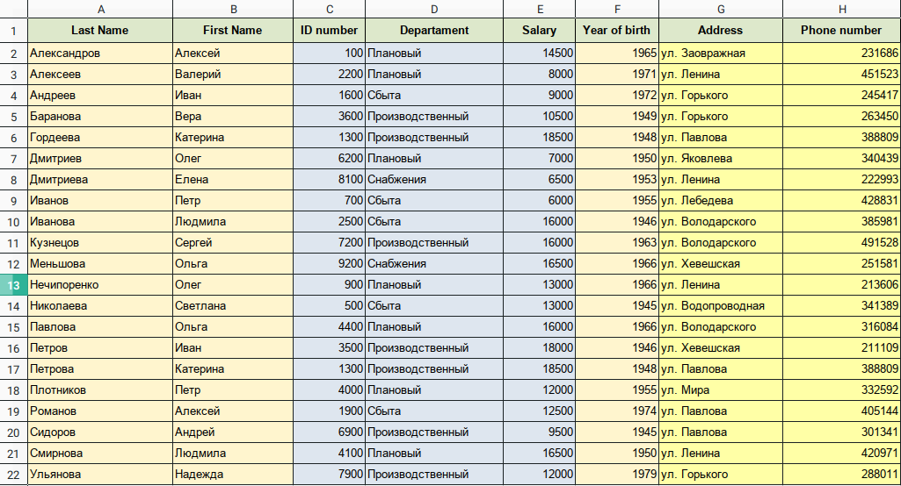
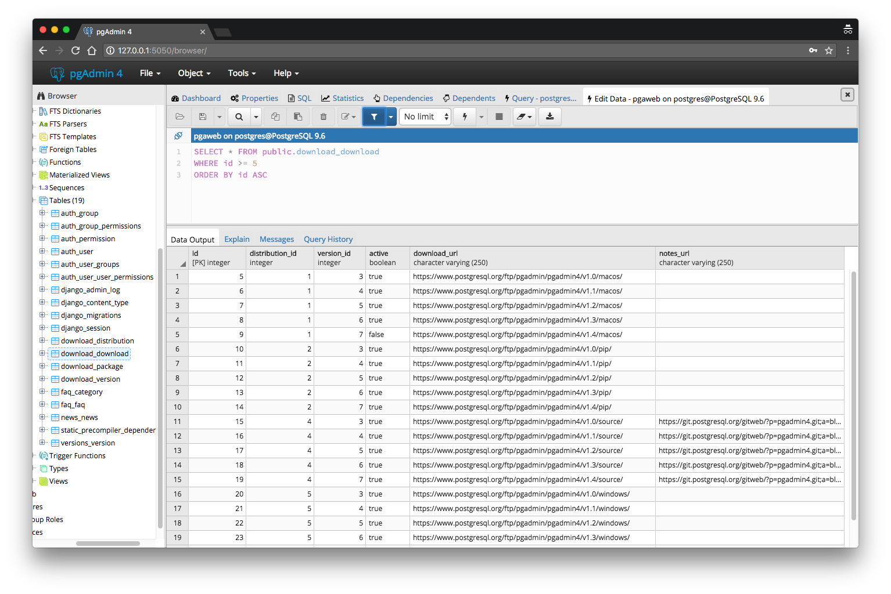

Структура реляционной базы данных—
Основы реляционных баз данных
PostgreSQL — СУБД, созданная для работы с реляционными базами данных. Понятие "реляционная" мы рассмотрим в уроке, посвященном реляционной модели, а сейчас сосредоточимся на ее прикладных аспектах. В этом уроке обзорно рассказывается о том, как устроены базы данных, а уже начиная со следующего, мы начнем создавать базу собственными руками.

Данные в реляционных базах данных представлены в табличном виде и хранятся в таблицах. Такая структура очень напоминает Microsoft Excel. Каждая строка в таблице — это связанный набор данных, относящийся к одному предмету.

Разные таблицы предназначены для хранения информации о различных сущностях: например, пользователи, статьи или заказы в интернет-магазине. В типичных веб-приложениях таблиц десятки и сотни. В больших — тысячи. На Хекслете их несколько сотен.

У таблиц в базе данных есть определенная структура, которая включает в себя фиксированный набор столбцов (говорят: "полей"). Поля расположены в строго определенном порядке, и каждое поле имеет свое уникальное имя в рамках одной таблицы. Еще у таблицы есть имя, которое, как правило, уникально в рамках одной базы данных. Имя таблицы и ее структура задаются при создании, но могут быть изменены впоследствии.

Каждому столбцу сопоставлен тип данных. Тип данных ограничивает набор допустимых значений, которые можно присвоить столбцу, и определяет смысловое значение данных для вычислений. Например, в столбец числового типа нельзя записать обычные текстовые строки, но зато его данные можно использовать в математических вычислениях. И наоборот, если столбец имеет тип текстовой строки, для него допустимы практически любые данные, но он непригоден для математических действий (хотя другие операции, например, конкатенация строк, возможны).

Число строк в таблице переменно — оно отражает текущий объем данных. В отличие от таблиц в Exсel, в таблицах реляционных баз данных нет никаких гарантий относительно порядка строк в таблице. Он может быть любым. При необходимости этот порядок можно задать с помощью языка SQL, который рассматривается далее по курсу.

Объем данных в разных таблицах варьируется очень сильно. Многие справочные таблицы, которые содержат некоторые фиксированные списки (например, список стран) очень небольшие, количество записей в них варьируется от нескольких штук до нескольких сотен. Другие таблицы могут иметь значительные размеры: От сотен тысяч до миллиардов записей.

Пример описания таблицы с именем users (на псевдоязыке):

Структура

users

first_name string
last_name  string
email      string
created_at datetime
Содержание

| first_name | last_name |       email       | created_at |
|------------|-----------|-------------------|------------|
| Сергей     | Петров    | serj@gmail.com    | 11.10.2005 |
| Иван       | Сидоров   | sidorov@yahoo.com | 03.08.2000 |
| Виктор     | Курганов  | vkurg@indbox.com  | 23.12.2011 |
В дальнейшем эту структуру можно модифицировать: удалять и добавлять поля, менять типы данных. Типичные таблицы содержат десятки полей, но бывают и большие, в которых полей за сотню.

Именование таблиц и полей в базе (и других сущностей) не фиксировано и зависит от программиста. В проектах, активно использующих ORM (название группы фреймворков или библиотек, которые помогают моделировать предметную область и связывать ее с базой данных), имена определяются соглашениями конкретной экосистемы. В этом курсе мы используем именование, принятое во фреймворке Rails и его ORM (ActiveRecord). Оно состоит из нескольких правил:

Все имена в нижнем регистре
Для имен, состоящих из нескольких слов, используется snake_case
Имя таблицы во множественном числе
В отличие от Excel, где ввод данных и отображение происходит визуально, в обычных СУБД данные не имеют никакого представления. Вводятся они с помощью команд и выбираются тоже, а вот дальше все зависит от программистов, которые выводят эти данные в своих программах. Но существуют специальные клиенты, предназначенные для удобного визуального управления базами данных. Можно сказать, что это "psql на стероидах".

Эти решения бывают как платные, так и бесплатные. Из бесплатных в мире PostgreSQL наиболее популярен PgAdmin. Рекомендую поставить его и поэкспериментировать внутри.

SQL
Управление структурой базы данных и данными внутри таблиц — две разных задачи, выполняющиеся одним инструментом — языком SQL. SQL (Structured Query Language) — специализированный язык, разработанный для управления данными в реляционных СУБД.

SELECT * FROM users;
Он разрабатывается независимо от баз данных и имеет собственный стандарт, который с тем или иным успехом реализуют конкретные базы данных. Эта новость должна вас обрадовать, так как на базовом уровне все реляционные базы работают примерно одинаково. Научившись работать с одной базой, несложно переключиться на другую. Как и в случае браузеров, которые пытаются поддерживать стандарты и имеют собственные расширения, базы данных также поддерживают основной SQL и местами дополняют его своими возможностями. На протяжение курса мы будем стараться использовать только стандартные возможности SQL.

С его помощью выполняются практически все задачи внутри СУБД: начиная с управления ролями и правами для них, заканчивая обновлением данных в таблицах конкретных баз данных. Даже создание базы данных выполняется с помощью SQL. SQL-запрос может быть как простым, так и очень сложным. Вряд ли существуют люди, которые знают его на 100%, но некоторый базис должны понимать все прикладные программисты.

Самостоятельная работа
Установите PgAdmin и подключитесь к СУБД, которую вы установили ранее. Для этого вам придется потратить некоторое время на изучение интерфейса программы. Подробный гайд с картинками
Изучите интерфейс программы и существующие базы данных
