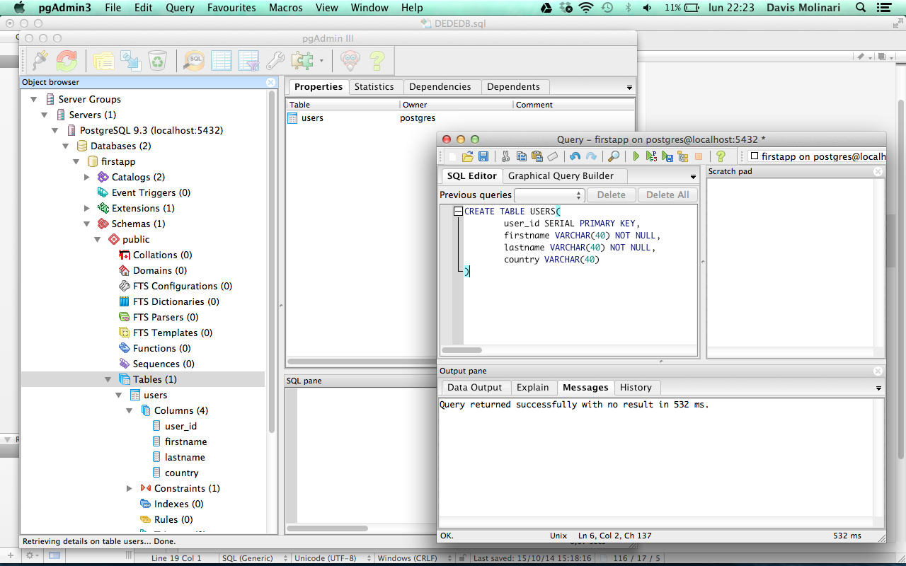

Создание таблиц—
Основы реляционных баз данных
В этом и нескольких следующих уроках мы пройдемся "галопом по европам". Не сильно вникая в тонкости различных запросов, создадим таблицу и попробуем поработать с ней, добавляя, модифицируя и удаляя данные.

Если вы еще не создали базу данных hexlet, то самое время это сделать. Сейчас попробуем выполнить эту задачу, используя SQL. Подключитесь к СУБД через psql (не указывая базу данных, тогда произойдет подключение к базе данных по умолчанию) и выполните следующие запросы:

DROP DATABASE hexlet;
CREATE DATABASE hexlet;
Если подключиться к той же базе данных, которую вы хотите удалить или пересоздать, то во время попытки удаления СУБД будет ругаться на то, что к базе есть активное соединение (ваше). Именно поэтому важно подключиться к любой другой базе данных.

В примере выше два SQL запроса: один из них удаляет базу данных с именем hexlet, а другой создает базу данных с таким же именем. Рассмотрим базовые правила построения запросов:

Каждый запрос должен заканчиваться точкой с запятой. Иначе psql будет думать, что вы продолжаете вводить команды.
Регистр не важен. Можно было написать drop database hexlet;. По сложившейся традиции принято использовать верхний регистр для ключевых слов самого SQL. Это позволяет визуально разделять структуру запроса от данных внутри него: в примере выше это имя базы данных, которое может быть произвольным.
Те самые команды createdb и createuser — не что иное, как обертки, выполняющие SQL запросы внутри СУБД. Их сделали только ради удобства первоначальной настройки и для использования в скриптах автоматизации.

Кстати, SQL поддерживает комментарии. Любая строчка, начинающаяся с двух дефисов — комментарий. Комментарии игнорируются СУБД при построении запросов.

hexlet=> -- i am comment
hexlet=>
Следующая задача — создать таблицу:

-- Это один запрос, хоть и многострочный. Описание запроса заканчивается символом ;
CREATE TABLE courses (
name          varchar(255),
slug          varchar(255),
lessons_count integer,
body          text
);
Запросы на создание таблиц принято форматировать так, как показано выше. Это облегчает чтение и анализ, но неудобно для работы в репле.

Этот запрос уже значительно сложнее предыдущего. Для создания таблицы обязательно указывается ее имя и перечисляется набор полей с указанием их типов данных. В примере выше создается таблица courses с четырьмя полями: name, slug, lessons_count и body.

Типы данных
Каждое поле в PostgreSQL имеет определенный тип, который задается на этапе создания таблицы. Это значит, что значением этого поля могут быть только определенные данные. Если поле имеет числовой тип, то в него невозможно вставить строку, и наоборот. База данных выдаст ошибку при попытке выполнить подобный запрос. PostgreSQL поддерживает большое количество встроенных типов и позволяет создавать свои (пользовательские).

В отличие от языков программирования, где строка может иметь произвольный размер, в базах данных чаще всего используется специальный тип varchar (в PostgreSQL его настоящее имя character varying, а varchar это псевдоним), который имеет фиксированный размер. Размер конкретного поля, имеющего такой тип, указывается в скобках после названия типа varchar(10). А вот тип text не требует указания размера и может содержать текст произвольной длины. Возникает резонный вопрос, зачем нужен varchar, когда можно использовать text и не думать о размерах. К сожалению, так не получится. Динамический размер типа text не дается бесплатно. Если все строки делать текстом, то у приложения очень быстро начнутся проблемы с производительностью. Подробнее вопросы производительности рассмотрим в конце курса.

Числа
Имя	Размер	Описание	Диапазон
integer	4 байта	типичный выбор для целых чисел	-2147483648 .. +2147483647
bigint	8 байт	целое в большом диапазоне	-9223372036854775808 .. 9223372036854775807
Даты
Имя	Размер	Описание	Наименьшее значение	Наибольшее значение	Точность
timestamp	8 байт	дата и время (без часового пояса)	4713 до н. э.	294276 н. э.	1 микросекунда
date	4 байта	дата (без времени суток)	4713 до н. э.	5874897 н. э.	1 день
time	8 байт	время суток (без даты)	00:00:00	24:00:00	1 микросекунда
Значения даты и времени принимаются практически в любом разумном формате, включая ISO 8601, SQL-совместимый и другие. Вот лишь несколько примеров того, как можно задавать дату:

Пример	Описание
1999-01-08	ISO 8601, 8 января в любом режиме (рекомендуемый формат)
January 8, 1999	воспринимается однозначно в любом режиме datestyle
Логический тип
Имя	Размер	Описание
boolean	1 байт	состояние: истина или ложь
Состояние «true» может задаваться следующими значениями:

TRUE
't'
'true'
'y'
'yes'
'on'
'1'
Для состояния «false» можно использовать следующие варианты:

FALSE
'f'
'false'
'n'
'no'
'off'
'0'
NULL
Как и в языках программирования, в базах данных присутствует специальное значение NULL, которое используется для пустых значений.

Строки
Имя	Описание
character varying(n), varchar(n)	строка ограниченной переменной длины
text	строка неограниченной переменной длины
Анализ структуры
Для манипуляции структурой базы данных лучше использовать PgAdmin. Он же позволяет исследовать структуру таблиц в визуальном режиме.

SQL для анализа структуры базы данных не существует, поэтому если вы хотите посмотреть список таблиц и их структуру в базе данных, то придется использовать команды самого psql.

Просмотр списка таблиц

hexlet=> \d
List of relations
Schema |  Name   | Type  |  Owner
--------+---------+-------+---------
public | courses | table | vagrant
Просмотр структуры таблицы

hexlet=> \d courses
Table "public.courses"
Column     |          Type          | Modifiers
---------------+------------------------+-----------
name          | character varying(255) |
slug          | character varying(255) |
lessons_count | integer                |
body          | text                   |
Полезные команды

\l — список всех баз данных
\dt — список всех таблиц
Удаление таблицы выполняется запросом DROP:

DROP TABLE courses;
Будьте внимательны. Удаление таблицы приводит к безвозвратной потере данных.

