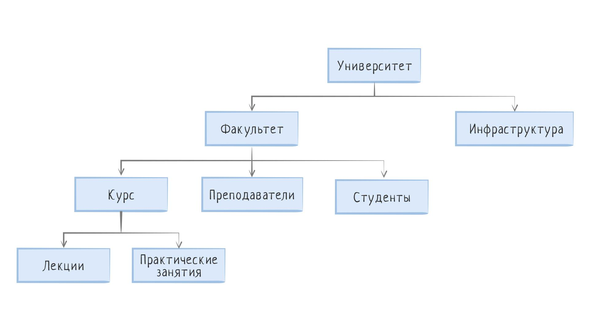
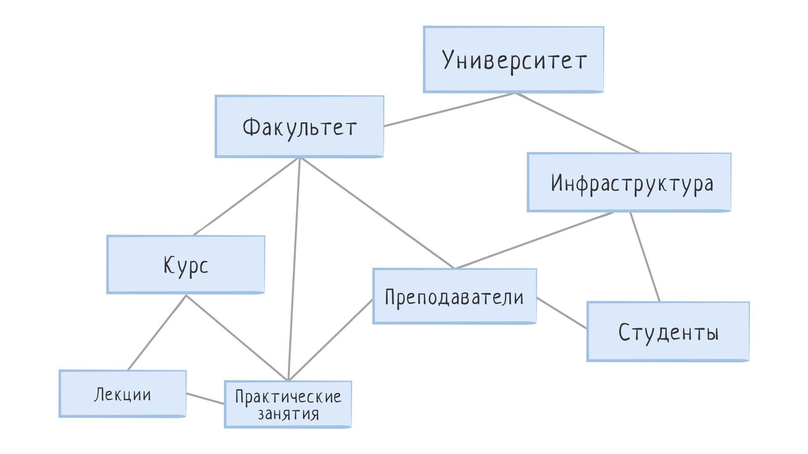
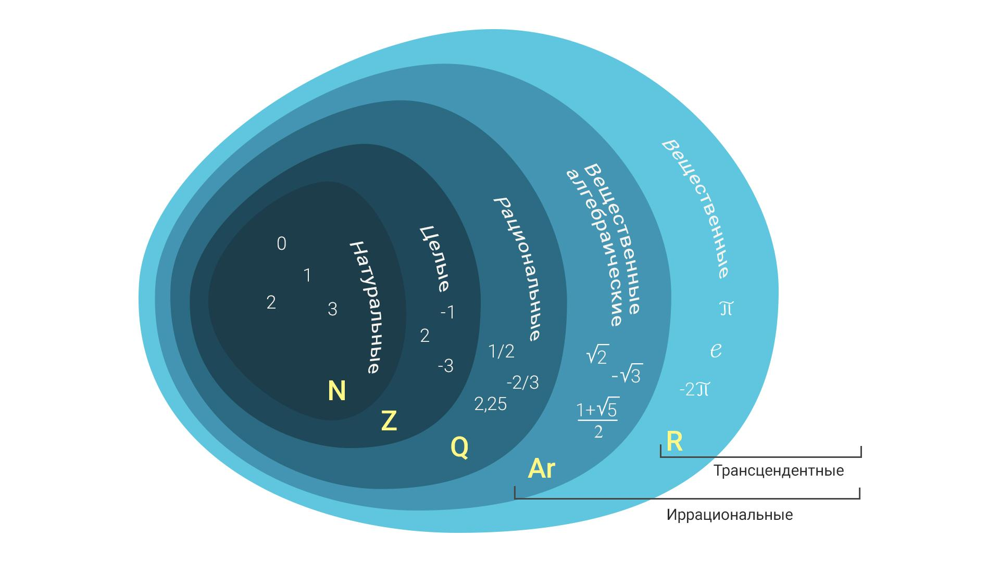
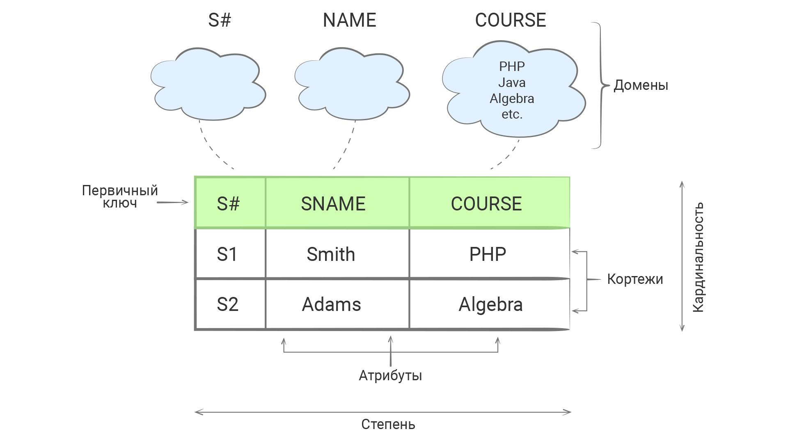

Реляционная модель данных—
Основы реляционных баз данных
Основой логики работы в реляционных СУБД является реляционная алгебра, именно поэтому в подобных системах добавляют приставку "реляционная". Если посмотреть книги, посвященные базам данных (особенно университетские), то они в обязательном порядке дают ее, и иногда в больших количествах. Несмотря на то, что прикладному программисту не обязательно разбираться в ее тонкостях, знать основы реляционной алгебры все же полезно. Ниже я попробую дать некоторое общее представление без привлечения соответствующего математического аппарата. Если вы захотите копнуть глубже, то смотрите ссылки в дополнительных материалах.

Иерархическая модель
Существует множество разных способов представить одни и те же данные. Один из первых широко используемых способов — иерархическая модель. В такой модели данные представлены в виде дерева, где дочерние элементы находятся в зависимости от родительских. Самый яркий пример древовидной структуры — файловая система (ФС). Вероятно, будет сюрпризом для вас, что файловая система — это база данных, а операционная система ведет себя, как СУБД по отношению к ФС. Однако то, как мы видим данные и как они хранятся в реальности (на диске) — две большие разницы. Физическое размещение данных на носителях — прерогатива конкретных СУБД, и здесь они соревнуются, кто быстрее и эффективнее. А вот их внешнее представление — это то, что видит пользователь, и оно очень сильно влияет на способ взаимодействия с данными. Именно поэтому разные способы представления данных называются моделями. Эти модели не отражают то, что происходит на самом деле (на физическом уровне), они лишь описывают то, как данные структурированы и как с ними взаимодействовать. Модели данных очень похожи на абстрактные типы данных, которые определяют интерфейс взаимодействия с типом и не определяют его внутреннюю реализацию.

С помощью иерархической модели можно представить и бизнес области. К примеру, в предметной области интернет-магазина есть такие понятия, как пользователь и заказ. Причем у одного пользователя может быть множество заказов, что сразу определяет структуру дерева, где вершиной становится пользователь, а его детьми — заказы. Подобным образом структурируются и все остальные части.

Проблемы начинаются, когда у одного ребенка может быть несколько родителей. В современных сервисах такси есть возможность оплачивать счет за такси совместно — это значит, что у одного заказа сразу несколько клиентов. Как быть в такой ситуации? К сожалению, иерархическая модель не может предложить хорошего решения данной задачи. Придется создавать параллельные деревья, в которых появится дублирование данных.

Сетевая модель
Эта проблема решается в сетевой модели данных, которая расширяет иерархическую и дает возможность иметь множество предков. По сути, сетевая модель представляет собой граф. В сетевой структуре каждый элемент может быть связан с любым другим элементом.

Недостатком сетевой модели данных являются высокая сложность и жесткость схемы БД, построенной на ее основе. Поскольку логика процедуры выборки данных зависит от физической организации этих данных, то эта модель не является полностью независимой от приложения. Другими словами, если необходимо изменить структуру данных, то нужно изменить и приложение.

Реляционная модель
В конечном итоге, наибольшее распространение получила реляционная модель данных. Именно на ее основе построены РСУБД (реляционные СУБД). В реляционной модели данные представляют собой набор отношений. Формальное определение понятия отношение звучит так:

Пусть дана совокупность типов данных T1, T2, ..., Tn, называемых также доменами, не обязательно различных. Тогда n-арным отношением R, или отношением R степени n называют подмножество декартовa произведения множеств T1, T2, ..., Tn.

Не пугайтесь, если вы ничего не поняли из этого определения. Попробуем разобраться.

Отношение — это, как вы уже догадались, математическое понятие, у него нет физического представления. Часто для упрощения говорят, что отношение — это как таблица. Такое сравнение хоть и кажется соблазнительным, но создает неверное представление о реальной природе и особенностях отношений. В этом смысле реляционная база данных — это лишь попытка отразить реляционную модель, а не ее точная копия.

Реляционная модель очень сильно опирается на теорию множеств, которую нужно знать хотя бы немного. Теория множеств — довольно простой и интуитивно понятный раздел математики. Центральное понятие теории множеств — множество, совокупность произвольных элементов, объединенных по какому-либо признаку, например, множество натуральных чисел (бесконечное множество) или множество учеников одного класса (конечное множество). Изучить этот раздел подробнее вы можете в нашем курсе «Теория множеств».

В свою очередь, из любого множества можно выделить подмножество. То есть множество элементов, все элементы которого входят в исходное множество. Другими словами, подмножество это часть множества. Например, множество натуральных чисел является подмножеством по отношению к множеству целых чисел, которое в свою очередь является подмножеством рациональных чисел. Из чего следует, что натуральные числа являются подмножеством и рациональных чисел.

Еще одно важное понятие — кортеж. Кортеж — это упорядоченный набор данных фиксированной длины. Элементами кортежа может быть все что угодно. В принципе, больше ничего интересного в кортежах нет, это всего лишь математический способ представить некоторый набор связанных данных.

Теперь мы знаем достаточно для изучения отношений. Отношение — это множество кортежей, называемых телом отношения, в котором каждый кортеж соответствует схеме. Схема — это заголовок отношения, она описывает общую структуру кортежей, количество элементов внутри них и их типы. Каждый такой элемент называется атрибутом.

Несмотря на визуальную схожесть с таблицей, у отношений есть существенные отличия:

В отношении нет двух одинаковых элементов (кортежей).
Порядок кортежей в отношении не определен.
Порядок атрибутов в заголовке отношения не определен.
Именно эти аспекты делают таблицу непригодной для точного описания понятия "отношение". В любой таблице порядок столбцов (соответствуют атрибутам схемы) и строк (соответствуют кортежам) строго определен. Но не следует путать теорию с практикой. На практике мы оперируем таблицами и не можем игнорировать их природу. Во всех реляционных базах данных столбцы расположены в определенном порядке, и данные тоже добавляются строго определенным образом. Другое дело, что этот порядок зависит от реализации самой базы данных и не может быть задан явно (он задается при выборке).

Как это ни странно, но реляционная модель оказывается удачным выбором в подавляющем большинстве ситуаций, и она не обладает недостатками, присущими другим моделям. Именно поэтому она приобрела столь широкое распространение. Но она требует время на освоение и привыкание, потому что придется научиться раскладывать данные по таблицам правильным способом. Для взаимодействия с данными, описанными реляционной моделью, используется реляционная алгебра (элементы которой рассмотрим позже).

С точки зрения теории, данные, представленные в реляционной модели, должны быть нормализованы, то есть приведены к нормальной форме. Нормальная форма — это некоторые требования, которым должно удовлетворять отношение для минимизации избыточности данных, потенциально приводящих к логическим ошибкам. Всего существует 6 нормальных форм, от первой до шестой. С каждым следующим уровнем требования все жестче и включают в себя все предыдущие уровни. Вот определения первых трех (не пытайтесь их понять и запомнить):

Переменная отношения находится в первой нормальной форме (1НФ) тогда и только тогда, когда в любом допустимом значении отношения каждый его кортеж содержит только одно значение для каждого из атрибутов.

Переменная отношения находится во второй нормальной форме тогда и только тогда, когда она находится в первой нормальной форме и каждый неключевой атрибут неприводимо (функционально полно) зависит от ее первичного ключа.

Переменная отношения находится в третьей нормальной форме тогда и только тогда, когда она находится во второй нормальной форме, и отсутствуют транзитивные функциональные зависимости неключевых атрибутов от ключевых.

В таком виде эта информация понятна только студентам профильных вузов. Поэтому дальше разговор пойдет о практических аспектах нормальных форм. В следующих уроках мы познакомимся с тремя нормальными формами, так как они наиболее часто используются в реальной разработке. Причем программисты, которые часто работают с базами данных, даже не помнят теорию, связанную с формами. Единожды поняв, как структурируются данные в реляционной модели, мозг самостоятельно предлагает правильные решения по тому, как разложить данные.

Дополнительные материалы
Основы реляционной алгебры
Реляционная модель данных