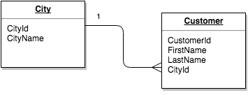

Вторая нормальная форма—
Основы реляционных баз данных
После предыдущих манипуляций мы получили такую таблицу:

order_items

id	first_name	last_name	address	item	price
8	Сергей	Иванов	Москва, ул. Промышленная	утюг	1000.00
2	Иван	Петров	Самара, ул. Энгельса	кофеварка	5000.00
7	Виктор	Сидоров	Омск, ул. Дворцовая	утюг	1000.00
4	Виктор	Сидоров	Омск, ул. Дворцовая	телевизор	6500.00
9	Сергей	Иванов	Москва, ул. Матросова	ноутбук	20000.00
6	Сергей	Иванов	Москва, ул. Матросова	ноутбук	20000.00
Вторая нормальная форма включает в себя два пункта:

Таблица должна быть в первой нормальной форме
Все атрибуты (не ключевые) таблицы должны зависеть от первичного ключа
Зависимость от первичного ключа означает, что этот атрибут имеет такое значение именно в данном контексте. Предположим, что в примере выше, Сергей — это всегда один и тот же человек, делающий заказ на разные адреса. В таком случае видно, что адрес привязан к конкретному заказу. Это и есть зависимость от первичного ключа. А вот имя пользователя и его фамилия с заказом никак не связано. Оно имеет отношение к самому пользователю.

Согласно второй форме, атрибуты first_name и last_name необходимо вынести в свою таблицу, которая будет отвечать за пользователей:

users

id	first_name	last_name
2	Сергей	Иванов
3	Иван	Петров
5	Виктор	Сидоров
В этой таблице всего три записи, потому что у нас три уникальных пользователя. Каждому из этих пользователей присваивается свой уникальный номер (первичный ключ).

Теперь нужно связать таблицу order_items с таблицей users. Делается это через указание первичных ключей в зависимых таблицах. Ниже пример:

order_items

id	user_id	address	item	price
8	2	Москва, ул. Промышленная	утюг	1000.00
2	3	Самара, ул. Энгельса	кофеварка	5000.00
7	5	Омск, ул. Дворцовая	утюг	1000.00
4	5	Омск, ул. Дворцовая	телевизор	6500.00
9	2	Москва, ул. Матросова	ноутбук	20000.00
6	2	Москва, ул. Матросова	ноутбук	20000.00
Мы удалили first_name, last_name и добавили user_id. В этом поле хранятся идентификаторы пользователей, а само поле называется внешним ключом (или вторичным).

Такую же операцию нужно произвести и с товаром. Вынесем item в свою таблицу:

goods

id	name
50	утюг
30	кофеварка
20	телевизор
33	ноутбук
order_items

id	user_id	address	good_id	price
8	2	Москва, ул. Промышленная	50	1000.00
2	3	Самара, ул. Энгельса	30	5000.00
7	5	Омск, ул. Дворцовая	50	1000.00
4	5	Омск, ул. Дворцовая	20	6500.00
9	2	Москва, ул. Матросова	33	20000.00
6	2	Москва, ул. Матросова	33	20000.00
Другой пример внешнего ключа в таблице покупателя и города:

Важно понимать, что внешний ключ — это не ссылка. Таблицы существуют сами по себе, и во внешнем ключе указывается конкретное значение, которое должно совпадать с первичным ключом другой таблицы.

Синтаксис определения вторичного (внешнего) ключа:

REFERENCES <название таблицы, на которую смотрим> (<список полей в той таблице, которым соответствуем>)

-- Внешних ключей может быть любое количество: сколько ссылок — столько и ключей
CREATE TABLE orders (
id bigint PRIMARY KEY,
-- Тип внешнего ключа должен быть такой же,
-- как у первичного в той таблице, куда ссылается внешний
user_id bigint REFERENCES users (id),
-- остальные поля
);
Для чего это нужно? Таким образом автоматически поддерживаются гарантии корректности. Например, невозможно удалить запись из основной таблицы, если на эту запись есть ссылки из внешних ключей в другой таблице. Это очень важно для соблюдения целостности, чтобы случайно не завести базу данных в неконсистентное состояние (то есть такое состояние, при котором данные ссылаются на несуществующие данные).

Дополнительные материалы
Потенциальный ключ