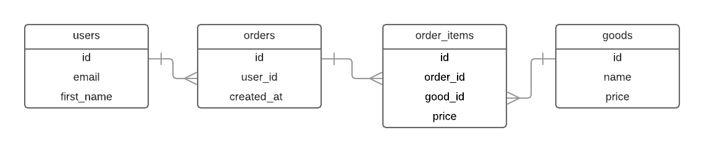

Каждый раз, когда мы совершаем покупки в интернете, на стороне продавца формируется «заказ». Это сущность, которая описывает собой конкретную покупку и включает в себя пользователя, а также список позиций. Если взять какой-нибудь интернет-магазин, торгующий электроникой, то в заказ могут входить клавиатура, мышка и коврик. Ниже представлена ERD в которой отражены сущности, участвующие в процессе.

ERD Заказа

На диаграмме выше цена из товара копируется в order_items. Подумайте, для чего это надо? Подсказка: мутабельность.

Реализуйте таблицы в соответствии с указанной выше диаграммой, кроме таблицы users, которая уже создана.

Подсказки
Перед тем как писать запросы в файл, зайдите в psql и поэкспериментируйте, как следует

create table orders (id bigint primary key generated always as identity, user_id bigint references users (id), created_at timestamp);
create table goods (id bigint primary key generated always as identity, name varchar(255), price numeric); 
create table order_items (id bigint primary key generated always as identity, order_id bigint references orders (id), good_id bigint references goods (id), price numeric);
