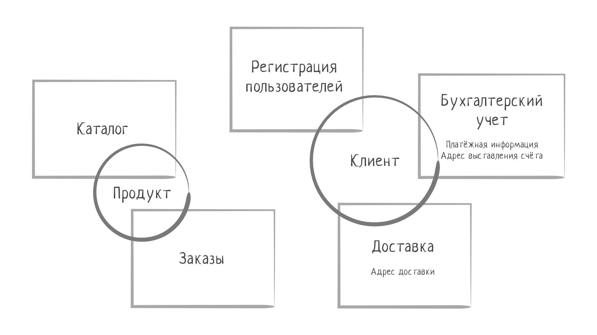
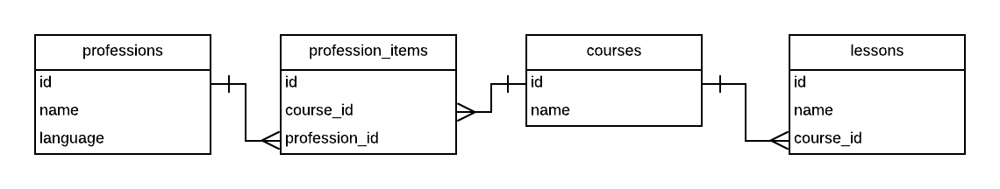
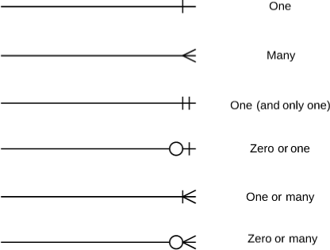
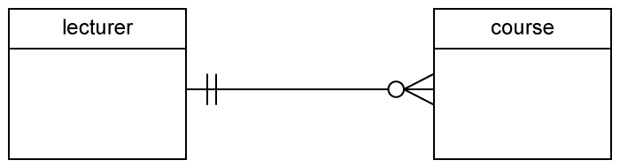
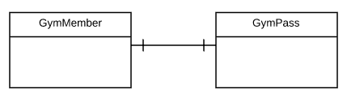
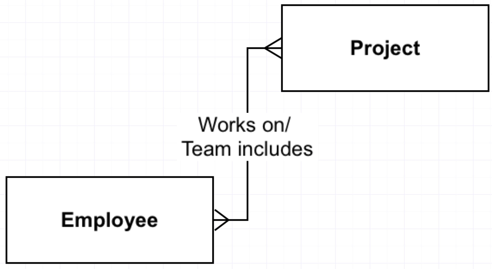

Онтология—
Основы реляционных баз данных
Ключ к овладению принципами организации данных в реляционных базах лежит не в заучивании форм нормализации и изучении реляционной алгебры, а в понимании смыслов, которые лежат вне области программирования.

Программы, которые пишут программисты, всегда создаются под определенную предметную область. Например, бухгалтерский софт основывается на правилах ведения бухгалтерского учета, а сайт для просмотра сериалов — на понятиях из телеиндустрии, таких как "сезон" или "эпизод". То же самое относится и ко всему остальному: бронирование авиабилетов, отелей, поиск туров, продажа/покупка недвижимости/автомобилей и так далее.

Понимание предметной области, для которой вы пишете программу, так же важно, как и умение программировать. Это не значит, что ее нужно знать досконально — иногда область может быть по-настоящему сложной (например, та же бухгалтерия или технологическое производство), но общее понимание все же требуется.

Рассмотрим как пример Хекслет, так как вы с ним достаточно хорошо знакомы. Вы неплохо знаете его предметную область, хотя вряд ли думали о ней так, как мы сделаем сейчас. В первую очередь, для ее понимания нужно выделить ключевые понятия, а именно сущности, вокруг которых строится вся логика. У обучающих ресурсов это, как правило, "курс" и "урок". Но на самом деле сущностей гораздо больше. В случае Хекслета еще можно выделить профессию, испытание (практика после курса), code review, квиз (набор вопросов и ответов), участника курса (вы становитесь участником, когда вступаете в курс), проект. Этот список можно продолжать еще долго. Но сущности не существуют сами по себе, они находятся в некоторых взаимоотношениях друг с другом. Например, квиз содержит (агрегирует) в себе вопросы, которые, в свою очередь, содержат в себе ответы. Профессия состоит из курсов, а курсы из уроков, уроки — из теории, квиза и практики. Эти связи имеют конкретные названия. Например, один урок может находиться только в одном курсе, но курс содержит множество уроков. Такая связь называется один ко многим (one-to-many или o2m). В свою очередь, один курс могут проходить множество пользователей, и один пользователь может проходить много курсов. Такая связь уже называется многие ко многим (many-to-many или m2m). Реже встречается связь один к одному (one-to-one или o2o). На Хекслете такая связь установлена между пользователем и аккаунтом на Facebook.

Описание объектов рассматриваемой области и связей между ними называется онтологией предметной области. Эту онтологию хорошо знают эксперты соответствующей области: в бухгалтерии — бухгалтер, в обучении — преподаватель. Но, в отличие от программистов, они часто представляют ее на интуитивном уровне, неформально. На практике программисты (или бизнес-аналитики и менеджеры) общаются с заказчиками, которые могут сами выступать в роли экспертов и строят вместе с ними формальную онтологию (этот процесс происходит постоянно в процессе развития проекта и не выделяется в отдельный этап проектирования). То есть выделяют конкретные термины, договариваются о том, что они означают и как связаны друг с другом. Затем, используя ER-модель, программист формирует необходимую модель данных. Не обязательно на бумаге или в специализированных программах, чаще такая модель существует только в голове и коде.

Именно эта модель и становится основной для проектирования базы данных. Каждая сущность в реляционной базе данных представлена таблицей, а связи между сущностями реализуются через внешние ключи.

Entity-Relationship Diagram
В ERD, каждая сущность представлена блоком, в котором перечисляются поля. Между блоками рисуются линии, имеющие некоторые заранее определенные концы, они определяют тип связи между сущностями.

Далее мы подробнее рассмотрим каждый вид связи.

Виды связей
Один ко Многим (one2many)

Наиболее распространенный вид связи. Например, у одного человека может быть много машин, телефонов, ноутбуков и так далее (все вещи, находящиеся в индивидуальной собственности). Технически, такая связь организуется через внешний ключ, добавленный в зависимую сущность (ту, которая "many").

users

id	first_name	last_name	created_at
1	Сергей	Петров	11.10.2005
38	Иван	Носов	03.08.2000
22	Виктор	Пирогов	23.12.2011
emails

id	user_id	email
1	1	serj@gmail.com
2	1	petrov@mail.ru
10	38	ivan@yahoo.com
22	22	vkurg@indbox.com
Если мы хотим узнать все емейлы, которые есть у пользователя с идентификатором 1, то нужно выполнить такой запрос:

SELECT * FROM emails WHERE user_id = 1;
Один к Одному

Например, у каждой страны есть ровно одна столица:

countries

id	name	created_at
2	Russia	11.10.2005
38	Spain	03.08.2000
22	Germany	23.12.2011
cities

id	name	country_id	capital	created_at
34	Moscow	2	true	11.10.2005
33	Valencia	38		03.08.2000
99	Voronezh	2		23.12.2011
4	Ulyanovsk	2		23.12.2011
5	Berlin	22	true	23.12.2011
Связь o2o обычно существует не сама по себе, а внутри связи o2m. То есть у каждой страны есть города, но только один из них столица.

Многие ко многим (many2many)

many2many встречается очень часто:

У каждого человека множество друзей, каждый человек друг для множества других.
Один человек проходит множество курсов, один курс проходится множеством людей.
Эта связь реализуется уже не так просто. Технически невозможно связать две таблицы связью многие ко многим без введения третьей таблицы.

users

id	first_name	created_at
2	Сергей	11.10.2005
38	Иван	03.08.2000
22	Виктор	23.12.2011
courses

id	name	created_at
8	PHP basics	11.10.2005
55	Python basics	03.08.2000
22	Ruby basics	23.12.2011
course_members

id	user_id	course_id	created_at
34	2	8	11.10.2005
33	38	55	03.08.2000
99	22	22	23.12.2011
4	22	8	23.12.2011
5	38	22	23.12.2011
Здесь исходные таблицы — это users и courses, а связующая — course_members. Она имеет свой первичный ключ, и каждая запись содержит ссылки как на конкретный курс, так и на конкретного пользователя. На Хекслете эта таблица начинает заполняться в тот момент, когда пользователь нажимает кнопку "Вступить в курс". Для данного пользователя создается запись с его идентификатором и идентификатором курса, который он собрался проходить.

Если мы захотим узнать все курсы, которые проходит пользователь, то выполним такой запрос:

SELECT course_id FROM course_members WHERE user_id = 3;
Если захотим узнать, кто проходит данный курс, то такой запрос:

SELECT user_id FROM course_members WHERE course_id = 3;
Такая структура соблюдается для любых двух сущностей, которые надо связать. В общем виде схема выглядит так: Есть исходные таблицы A и B. Для них создается новая таблица AB, внутри которой есть два внешних ключа — a_id и b_id, которые связаны с исходными таблицами.

Как показывает жизнь, такая промежуточная таблица почти наверняка становится самостоятельной сущностью. Если брать курсы, то важно понимать, закончил ли пользователь курс или нет, хочется знать, когда конкретно он это сделал, сколько заданий решил и так далее. Вся эта информация может храниться только в одном месте, именно в той связанной таблице.

Дополнительные материалы
Онтология (информатика)