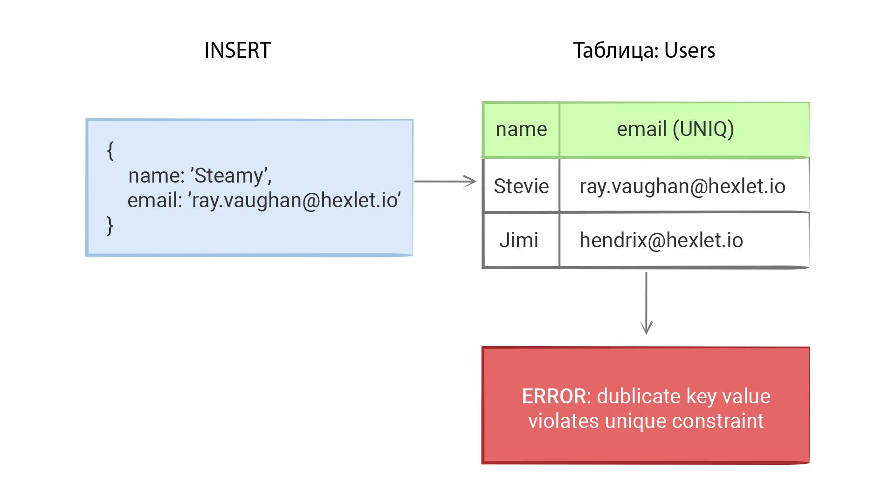

Ограничения—
Основы реляционных баз данных
Первичные и внешние ключи в базах данных относятся к понятию Constraints ("ограничения"). Оно включает в себя различные модификаторы колонок в базе данных, добавляющие ограничения на их содержимое. В этом уроке мы вспомним, что уже проходили, а заодно рассмотрим новые и крайне полезные ограничения.

Первичный ключ
Первичный ключ однозначно идентифицирует каждую запись внутри таблицы. Задается с помощью фразы PRIMARY KEY, которая добавляется после указания типа при создании таблицы. Первичный ключ в таблице может быть только один и, как правило, для него используется суррогатный ключ — идентификатор, который не имеет никакого физического смысла.

CREATE TABLE products (
id bigint PRIMARY KEY,
name text,
price numeric
);
Внешний ключ
Это ограничение, которое связывает указанную колонку с данными из другой таблицы. Такое ограничение гарантирует целостность данных. То есть попытка удалить данные, у которых есть зависимые данные, приведет к ошибке.

CREATE TABLE orders (
id bigint PRIMARY KEY,
product_id bigint REFERENCES products (id),
quantity integer
);
В данной таблице атрибут product_id связан с атрибутом id таблицы products. Синтаксически для этого добавляется ключевое слово REFERENCES после типа поля, затем добавляется имя таблицы, на которую идет связь, а в скобках указывается поле, с которым эта связь создается. Как проявляется наличие такой связи?

Если попробовать вставить в orders запись со значением product_id, которого нет в таблице products, то возникнет ошибка
Если попытаться удалить запись из products, на которую есть ссылки из таблицы orders, то возникнет ошибка
То есть внешний ключ проверяет целостность данных и не позволяет появляться "мусору". Поэтому лучше ставить внешние ключи на все идентификаторы, для которых есть родительская таблица в базе.

Внешние ключи поддерживают несколько вариаций. Таким образом они поддерживают целостность, но не приводят к ошибкам при попытке удалить запись. Одна из них — «каскадное удаление»:

CREATE TABLE orders (
product_id bigint REFERENCES products (id) ON DELETE CASCADE,
);
В таком варианте, при попытке удалить родительскую запись (products), будут удалены все записи в orders ссылающиеся на этот продукт. Каскадное удаление полезная, но опасная опция. Можно случайно лишиться данных. Стоит хорошо подумать прежде чем включать ее.

Другой вариант — записи остаются, но вместо идентификатора проставляется null:

CREATE TABLE orders (
product_id bigint REFERENCES products (id) ON DELETE SET NULL
);
Используется нечасто, но иногда может быть полезно.

Not Null
Это ограничение указывает на то, что колонка не может содержать null значения. Его можно комбинировать с другими ограничениями, например, внешними ключами. Первичный ключ является NOT NULL по умолчанию.

CREATE TABLE products (
id bigint PRIMARY KEY,
name text NOT NULL,
price numeric
);
CREATE TABLE orders (
id bigint PRIMARY KEY,
product_id bigint REFERENCES products (id) NOT NULL,
quantity integer
);
Уникальность

Для гарантии уникальности значений одного поля используется ключевое слово UNIQUE. Обычно его используют в описании конкретного поля при создании таблицы:

CREATE TABLE products (
id bigint PRIMARY KEY,
name text UNIQUE,
price numeric
);
UNIQUE никогда не используется совместно с первичным ключом, так как он уникален по определению.

Иногда бывает нужно реализовать уникальность по двум или более атрибутам. Для этого нужно описать UNIQUE отдельно от конкретного поля:

CREATE TABLE products (
id bigint PRIMARY KEY,
name text,
locale varchar,
price numeric,
UNIQUE(name, locale)
);
Существует ситуация, в которой ограничение уникальности не срабатывает. Такое происходит, если хотя бы в одном из столбцов, включенных в ограничение, встречается NULL. По стандарту, NULL никогда не равен самому себе.

Дополнительные материалы
Официальная документация по ограничениям