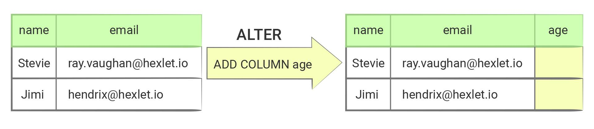

Изменение структуры таблицы (ALTER)—
Основы реляционных баз данных
Наиболее сложный запрос при работе с таблицами — обновление структуры таблицы. Если посмотреть официальную документацию, то общая запись этого запроса занимает больше трех экранов монитора! Хочу сразу вас успокоить, думаю ни один человек на свете не помнит всех возможностей этой команды. Более того, большинство из них настолько редко выполняются, что программисты каждый раз лезут в гугл и вспоминают синтаксис. Единственное, что нужно знать — возможности этой команды (общие принципы ее работы), а детали всегда можно будет найти в документации.

Этот тип запроса называется ALTER и включает в себя четыре разных операции со столбцами:

Добавление колонки

-- в таблице "users"
-- добавить колонку с именем "age" и типом "int"
ALTER TABLE users ADD COLUMN age int;
Здесь после фразы ADD COLUMN идет строка описания новой колонки, точно такая же, как и при создании таблицы. В простейшем случае она выглядит так: <имя колонки> <тип>. Здесь можно указывать любые ограничения, добавлять ключи, автогенерацию, значение по умолчанию и многое другое. Самое приятное, что синтаксис на 100% совпадает с синтаксисом определения колонки при создании таблицы.

Переименование колонки
-- в таблице "courses"
-- изменить колонку "example1":
-- поменять имя с "example1" на "example2"
ALTER TABLE courses RENAME COLUMN example1 TO example2;
Простая операция, в которой нет никаких сюрпризов. Одно имя меняется на другое.

Удаление колонки
-- в таблице "courses"
-- удалить колонку с именем "example2"
ALTER TABLE courses DROP COLUMN example2;
Тоже простая операция: удаление — оно и в Африке удаление ;)

Обновление колонки
Команда по изменению параметров колонки наиболее сложная. Практически каждый элемент, который поддается обновлению, имеет собственный синтаксис для этого обновления. Вот несколько базовых примеров:

ALTER TABLE addresses
ADD PRIMARY KEY (id);

ALTER TABLE addresses
ALTER COLUMN created_at SET DATA TYPE timestamp,
ALTER COLUMN street DROP NOT NULL;

-- Добавление ограничения NOT NULL в таблицу addresses для колонки city
ALTER TABLE addresses
ALTER COLUMN city SET NOT NULL;

-- Добавление уникального индекса в таблицу "products" для колонки "product_id"
ALTER TABLE products ADD UNIQUE (product_id);
Наиболее распространенные команды:

ADD — добавление ограничения: например, ключа или уникальности
SET — установка значения: например, типа данных
DROP — удаление ограничения
В рамках одного обновления можно группировать операции, но существует ряд исключений. Например, группировке не поддается операция RENAME — ее нужно выполнять отдельным запросом, иначе СУБД завершит запрос с ошибкой.

На практике
Стоит сказать, что операции по переименованию или удалению колонок не являются безопасными. Удаление колонки в работающей базе данных, приведет к ошибкам во время вставки или обновления записей. Любые выборки включающие эту колонку, также завершатся с ошибкой.

Поэтому такие операции выполняют редко и только тогда, когда есть уверенность, что эти колонки никто не использует. Кроме того, обновление колонки может серьезно влиять на производительность и, в некоторых ситуациях (если данных много) — выполняться продолжительное (многие часы и даже дни!) время.

Обновление структуры базы данных — очень серьезная история, которой посвящена не одна книга.

Дополнительные материалы
Официальная документация
Рефакторинг баз данных. Эволюционное проектирование