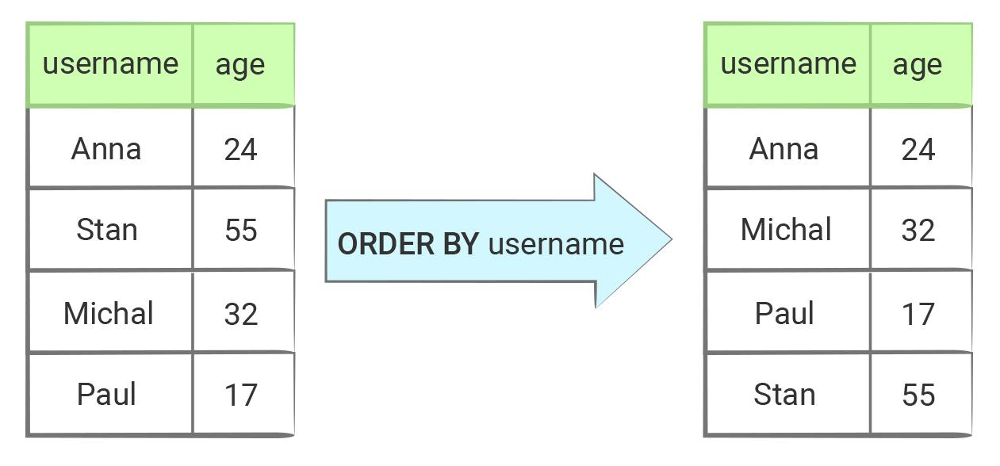

Сортировка (ORDER)—
Основы реляционных баз данных
Попробуйте выполнить запросы из урока на локальной базе данных, которую мы установили ранее.

Неопределенность порядка сортировки
Выборка данных из базы не имеет определенного порядка, точнее порядок есть, но он никак логически не обоснован. По умолчанию база данных возвращает данные в том порядке, в котором ей удобнее. По счастливому стечению обстоятельств этот порядок может совпасть с желаемым, но рассчитывать на это нельзя. Теоретически он может поменяться при следующем запросе или когда количество данных в таблице изменится. Обновление версии базы данных тоже может повлиять на это.

Общая схема запроса на сортировку

Сортировка задается с помощью части ORDER BY, за которой следует имя поля, по которому происходит сортировка:

SELECT * FROM users ORDER BY username;
База данных — умная штука, она знает, как сравнивать не только числа, но и строки, и даты. Сортировка по датам — крайне частая операция, выглядит она идентично любой другой сортировке:

SELECT * FROM users ORDER BY created_at;
Управление порядком сортировки
Если ничего дополнительно не указывать, то ORDER BY сортирует в прямом порядке — от меньшего к большему. Запрос выше — это сокращенная версия полного запроса с сортировкой: полный запрос включает в себя ASC, который подставляется автоматически, если ничего не указано:

SELECT * FROM users ORDER BY created_at ASC;
-- то же самое что и SELECT * FROM users ORDER BY created_at;
Для сортировки в обратном порядке указывается DESC:

SELECT * FROM users ORDER BY created_at DESC;
Иногда возникает необходимость сортировать данные сразу по нескольким полям. Этого легко добиться, просто перечисляя поля через запятую:

SELECT * FROM users ORDER BY first_name, created_at;
Порядок сортировки в таком случае задается для каждого поля индивидуально:

SELECT * FROM users ORDER BY first_name DESC, created_at DESC;
SELECT first_name, created_at FROM users ORDER BY first_name ASC, created_at DESC;
first_name	created_at
Maryse	2019-03-04 13:03:01
Maryse	2018-12-06 10:24:04
Maryse	2018-12-06 10:09:48
Sunny	2019-03-04 13:04:28
Sunny	2018-12-06 06:19:30
Tanya	2018-12-06 07:12:01
Tanya	2018-12-05 23:55:15
В этой выборке сначала выполняется сортировка по имени в прямом порядке. Затем, внутри групп с одинаковым именем, происходит сортировка по created_at в обратном порядке.

Сортировка NULL-значений
У сортировки есть один тонкий момент, связанный с сортировкой полей, содержащих NULL. Если ничего не указано дополнительно, то считается, что NULL больше любого значения. Другими словами, при прямой сортировке они окажутся в конце выборки, а при обратной — в начале. Этим поведением можно управлять с помощью фразы NULLS FIRST:

-- сортируем по возрастанию даты (поле "created_at")
-- поведение по умолчанию:
-- поля, содержащие NULL, идут последними
SELECT * FROM users ORDER BY created_at ASC;

-- сортируем по возрастанию даты (поле "created_at")
-- поля, содержащие NULL, идут первыми
SELECT * FROM users ORDER BY created_at ASC NULLS FIRST;
и NULLS LAST:

-- сортируем по убыванию даты (поле "created_at")
-- поведение по умолчанию:
-- поля, содержащие NULL, идут первыми
SELECT * FROM users ORDER BY created_at DESC;

-- сортируем по убыванию даты (поле "created_at")
-- поля, содержащие NULL, идут последними
SELECT * FROM users ORDER BY created_at DESC NULLS LAST;
Дополнительные материалы
Официальная документация