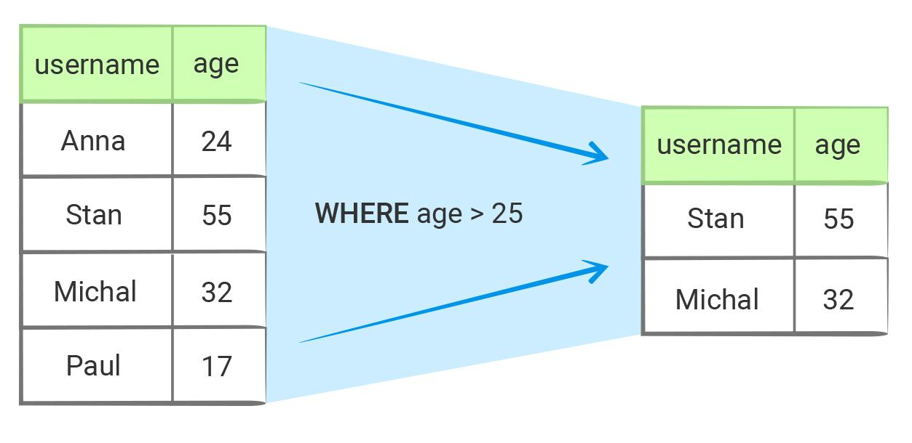

Условия (WHERE)—
Основы реляционных баз данных
WHERE
Самое простое условие — указание прямого соответствия. Например, выборка по идентификатору:

-- В случае базы данных знак `=` должен восприниматься
-- как математическое равенство, а не присваивание.
SELECT * FROM users WHERE id = 3;

UPDATE users SET first_name = 'Valya' WHERE id = 3;

DELETE FROM users WHERE id = 3;
Первый запрос выше звучит так: выбрать всех пользователей, у которых идентификатор равен трем. Вероятно, такая формулировка звучит странно. Раз мы выбираем по идентификатору, то и запись должна быть одна? Да, с точки зрения семантики идентификатора (каждый пользователь имеет уникальный идентификатор) она будет одна. Но важно не забывать, что наша база данных реляционная и в реляционной базе данных результатом любой операции над множеством (отношением) является множество! В случае если ничего не найдено, возвращается не "пустота", а пустое множество. Если же в базе есть пользователь с указанным идентификатором, то вернется множество, содержащее один элемент — найденного пользователя.

Если нужно получить все записи, кроме тех, что имеют определенное значение (даже если запись одна), то нужно = ("равно"), заменить на != ("НЕ равно"):

-- выбрать всех пользователей с идентификатором, НЕ равным трем
SELECT * FROM users WHERE id != 3;
Проверка на равенство с NULL
Сравнение с конкретным значением работает для всех типов данных, кроме NULL. У последнего свой собственный синтаксис.

Равно NULL:

SELECT * FROM users WHERE first_name IS NULL;
Не равно NULL:

SELECT * FROM users WHERE created_at IS NOT NULL;
NOT, как и отрицание в языках программирования, может добавляться практически к любому оператору.

Равенство строк
Работа со строками тоже имеет свои особенности. В соответствии со стандартом ANSI SQL, строки в PostgreSQL регистрозависимые. Это значит, что следующие два запроса выбирают разные данные:

SELECT * FROM users WHERE first_name = 'sunny';
SELECT * FROM users WHERE first_name = 'Sunny';
По этой причине данные в базе стараются хранить в нормализованном виде. То есть, перед добавлением в БД их приводят, например, к нижнему регистру, и то же самое делают при выборках. Классический пример — email. Его нужно хранить только в нижнем регистре.

Другие операции сравнения

Кроме точного соответствия SQL поддерживает и все остальные операции сравнения: > (больше), < (меньше), != (не равно), >= (больше либо равно, "не меньше"), <= (меньше либо равно, "не больше").

SELECT *
FROM users
WHERE created_at < '2018-10-05';
Логические операторы
В свою очередь все операции можно объединять в цепочки, используя логические операторы OR и AND:

SELECT *
FROM users
WHERE created_at > '1998-10-05' AND created_at < '2018-10-05';
Как и в случае с языками программирования, здесь действуют те же приоритеты. Чтобы не создавать неоднозначностей, в сложных ситуациях используются круглые скобки:

SELECT *
FROM users
WHERE first_name = 'Sunny' OR (created_at > '2018-01-01' AND created_at < '2018-10-05');
BETWEEN
Для условий диапазонов SQL поддерживает особый формат BETWEEN:

SELECT *
FROM users
WHERE created_at BETWEEN '2018-01-01' AND '2018-10-05';
-- Идентично SELECT * FROM users WHERE created_at >= '2018-01-01' AND created_at <= '2018-10-05';
Обратите внимание, что BETWEEN при сравнении включает границы диапазона.

IN
В некоторых ситуациях требуется найти не диапазон строк, а строки, в которых поле соответствует одному значению из набора. Предположим, что мы хотим найти пользователей с идентификаторами 1, 2 или 5, выполнив один запрос. Наиболее очевидный способ — использовать OR:

SELECT * FROM users WHERE id = 1 OR id = 2 OR id = 5;
Страшно представить, во что превратится запрос, если понадобится найти десяток совпадений. К счастью, SQL предлагает другое решение — IN:

SELECT * FROM users WHERE id IN (1, 2, 5);
Если нужно исключить определенные записи, достаточно добавить NOT:

SELECT * FROM users WHERE id NOT IN (1, 2, 5);
LIKE
Иногда нужно искать по частичному совпадению: например, проверяя, что строка начинается или заканчивается с определенной последовательности символов. Допустим, мы хотим посмотреть пользователей, имя которых начинается с буквы A:

SELECT * FROM users WHERE first_name LIKE 'A%';
% — специальный заполнитель, который означает "все, что угодно". Если его поставить в конце, то поиск выполняется по совпадению в начале фразы, если в начале — то по совпадению с концом, а если по краям — то проверяется совпадение внутри текста. Совпадение в конце может понадобиться для анализа пользователей, зарегистрированных с определенного почтового домена:

SELECT * FROM users WHERE email LIKE '%hotmail.com';
Обратите внимание на то, что этот поиск регистрозависимый. Если вы хотите искать БЕЗ учета регистра, то используйте ILIKE.

Дополнительные материалы
Официальная документация