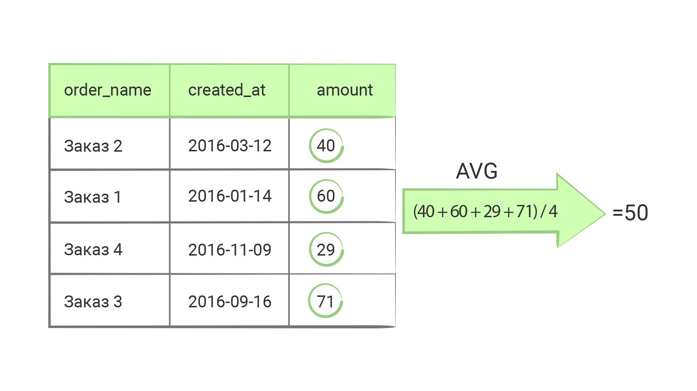

Функции—
Основы реляционных баз данных
При реализации пейджинга обычно показывают общее число страниц. Для этого надо посчитать число строк в конкретной таблице. Как это сделать? Обычная выборка уже никак не поможет, но помогут функции. SQL — это больше, чем просто язык запросов. Это практически язык программирования, хотя и очень специфичный.

Функции, которые что-то считают по таблице, называются агрегатными. К ним относятся нахождение числа записей, суммы значений, среднего арифметического и многое другое. В этом уроке мы рассмотрим только самые популярные, полный список функций смотрите в документации.

COUNT
SELECT COUNT(*) FROM users;

count
-------
    99
(1 row)
COUNT() — функция, которая считает количество записей в выборке. Подчеркну, не в таблице, а в выборке:

SELECT COUNT(*) FROM users WHERE birthday < '2018-10-21';

count
-------
    91
(1 row)
Такой запрос вернет ровно одну запись с одним значением — количеством строк по указанному условию.

Функция COUNT() относится к агрегирующим (агрегатным) функциям. У нее есть несколько форм:

Когда аргументом функции является *, она считает количество строк
Если в нее передать имя конкретного поля, то она посчитает количество строк, в которых это поле НЕ равно NULL
Max, Min
Функции MAX и MIN позволяют находить максимальное и минимальное значение соответственно:

SELECT MAX(birthday) FROM users WHERE gender = 'male';

    max
------------
2018-12-06
(1 row)

SELECT MIN(birthday) FROM users WHERE gender = 'female';

    min
------------
2017-12-08
(1 row)
Sum
Функция SUM находит сумму всех значений.

-- Получить сумму всех заказов из таблицы orders,
-- которые были совершены в 2016 году.
SELECT SUM(amount) FROM orders
WHERE created_at BETWEEN '2016-01-01' AND '2016-12-31';

Avg

Функция AVG находит среднее арифметическое всех значений:

-- Получить среднюю стоимость всех заказов из таблицы orders,
-- которые были совершены в 2016 году.
SELECT AVG(amount) FROM orders
WHERE created_at BETWEEN '2016-01-01' AND '2016-12-31';
Дополнительные материалы
Официальная документация