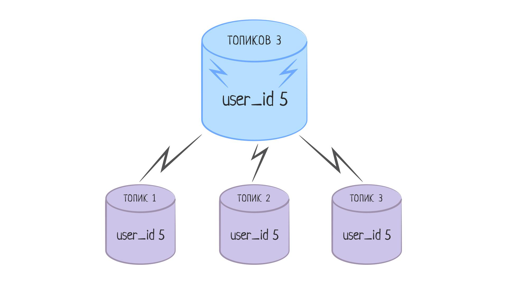

Группировка (GROUP)—
Основы реляционных баз данных

Типичные задачи, связанные с агрегатными функциями, выглядят так: вывести общее число топиков для каждого пользователя. Используя только функции, невозможно выполнить данную задачу за один запрос, придется делать выборку для каждой категории индивидуально:

SELECT COUNT(*) FROM topics WHERE user_id = 3;
SELECT COUNT(*) FROM topics WHERE user_id = 4;
-- ...
Если пользователей тысячи (десятки, сотни, миллионы!), то такое решение вопроса неприемлемо в принципе. Подобные задачи возникают настолько часто, что для них существует специальная форма GROUP BY. Группировка, как это ни странно, группирует строки по определенному признаку для выполнения подсчетов внутри каждой группы независимо от других групп.

SELECT user_id, COUNT(*) FROM topics GROUP BY user_id;

user_id | count
---------+-------
71 |     1
80 |     1
84 |     3
92 |     1
60 |     1
97 |     2
98 |     1
44 |     1
40 |     1
43 |     1
В запросе выше создаются группы записей по значению поля user_id. Это можно представить себе как набор виртуальных таблиц, каждая из которых содержит все записи, принадлежащие одному пользователю. Подсчет количества идет по каждой из этих таблиц (групп) независимо от других. К результатам такой выборки можно применять сортировку и лимитирование:

SELECT user_id, COUNT(*) FROM topics GROUP BY user_id ORDER BY count DESC LIMIT 3;

user_id | count
---------+-------
84 |     3
97 |     2
57 |     2
Сортировка позволяет обращаться не только к полям самой таблицы, но и к вычисленному значению. По умолчанию имя этого "виртуального" поля совпадает с именем функции, но его можно изменить с помощью механизма псевдонимов:

SELECT user_id, COUNT(*) AS topics_count
FROM topics
GROUP BY user_id
ORDER BY topics_count DESC
LIMIT 3;
Псевдонимы создаются не только для агрегатных значений, но и для любых имен, перечисляемых в запросе, переименовываются даже существующие поля. Общая структура задания имени выглядит так: <expression> AS <name>.

SELECT first_name AS name FROM users;
Псевдонимы хороши тем, что если определить их в одном месте, они становятся доступны в других частях SQL запроса:

SELECT first_name AS name FROM users ORDER BY name;
Вопрос на засыпку: а что произойдет, если мы попытаемся выполнить следующий запрос:

SELECT user_id, created_at, COUNT(*) AS topics_count FROM topics GROUP BY user_id;
Он завершится с ошибкой:

ERROR:  column "topics.created_at" must appear in the GROUP BY clause or be used in an aggregate function
LINE 1: SELECT user_id, created_at, COUNT(*) AS topics_count FROM topics G...
Понимание того, почему запрос выше не сработает — ключ к пониманию работы GROUP BY. Группировка — операция, которая создает из записей таблицы независимые группы записей, по которым проводится анализ. Группа записей — не то же самое, что одна запись. Это значит, что мы не можем просто взять и указать имя любого поля, надеясь, что база данных сама выберет какое-то значение из этой группы. Такое поведение создает неоднозначность и, по сути, бесcмысленно. Поэтому СУБД отслеживает такие ошибки и просит выполнить одно из двух действий:

Указать поле created_at в выражении GROUP BY. Тогда значение этого поля для каждой записи из группы будет одинаковым (в этом и суть группировки), а значит, СУБД однозначно определит, что нужно добавить в результат:

SELECT user_id, created_at, COUNT(*) AS topics_count
FROM topics
GROUP BY user_id, created_at;

user_id |       created_at        | topics_count
---------+-------------------------+--------------
40 | 2018-12-05 18:40:05.603 |            1
67 | 2018-12-06 05:23:40.65  |            1
Такой запрос выполнит группировку сначала по user_id, а затем по дате создания. Так как даты создания у всех топиков уникальны (почти наверняка), то вся таблица разобьется на группы по одному элементу. Смысла в таком запросе не очень много, гораздо полезнее сделать то же самое с разбивкой по дням или месяцам. Тогда можно будет увидеть сколько топиков создает конкретный пользователь каждый день:

-- В этом запросе используется функция EXTRACT,
-- которая извлекает значения из даты: например, номер дня или месяца
SELECT user_id, EXTRACT(day from created_at) AS day, COUNT(*) AS topics_count
FROM topics
GROUP BY user_id, day
ORDER BY user_id;

user_id | day | topics_count
---------+-----+--------------
1 |   5 |            1
1 |   6 |            1
4 |   6 |            1
6 |   5 |            1
7 |   6 |            2
8 |   5 |            1
9 |   6 |            1
Использовать created_at внутри агрегатной функции: в таком случае будет получен результат на основе анализа всех значений в рамках группы. Например, добавление вызова MAX(created_at) посчитает дату последнего добавленного топика для каждой группы:

SELECT user_id, MAX(created_at), COUNT(*) AS topics_count
FROM topics
GROUP BY user_id;

user_id |           max           | topics_count
---------+-------------------------+--------------
40 | 2018-12-05 18:40:05.603 |            1
67 | 2018-12-06 05:23:40.65  |            1
49 | 2018-12-06 14:55:08.99  |            1
43 | 2018-12-06 00:20:11.835 |            1
HAVING
В более сложных ситуациях бывает нужно проводить анализ только по некоторым группам. Предположим, что мы хотим выбрать всех пользователей, у которых количество топиков больше одного. Эта задача сводится к поиску групп, в которых число записей превышает число 1. Подобный запрос невозможно сделать, используя WHERE, так как эти условия применяются к записям исходной выборки, еще до создания самих групп. Для реализации данной задачи понадобится дополнение к GROUP BY, которое называется HAVING.

SELECT user_id, COUNT(*) FROM topics
GROUP BY user_id
HAVING COUNT(*) > 1;

user_id | count
---------+-------
84 |     3
97 |     2
57 |     2
30 |     2
83 |     2
7 |     2
38 |     2
1 |     2
(8 rows)
Подчеркну, что HAVING нужен для отбора групп по какому-то агрегатному признаку: например, количеству записей в группе. В ситуациях, когда надо смотреть значение конкретного поля — используйте WHERE.

Группировка — мощный, но в то же время сложный инструмент, позволяющий анализировать данные в таблицах. Не заморачивайтесь над тем, чтобы выучить его от и до прямо сейчас. Опытные разработчики пользуются им не каждый день и сами постоянно подсматривают в документацию. Важно понимать спектр задач, для которых группировка подходит, а остальное — дело техники и умения читать документацию. Это общее правило, характерное для изучения многих других аспектов баз данных.

Дополнительные материалы
Официальная документация