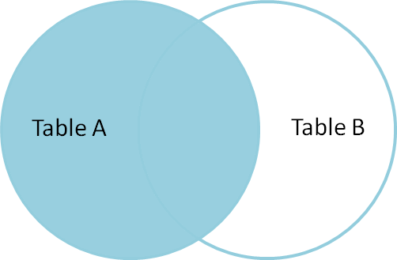

Соединения (JOINS)—
Основы реляционных баз данных
Как мы уже знаем, реляционная модель подразумевает связь между данными разных отношений посредством внешних ключей. С практической точки зрения это значит, что, зная первичный ключ одной сущности, мы можем извлечь связанные с ней данные из другой сущности.

-- Извлекаем все топики пользователя с id = 3
SELECT * FROM topics WHERE user_id = 3;
В простых ситуациях данные извлекаются так, как показано выше. Но есть множество ситуаций, где простой выборкой не обойтись. Предположим, что мы хотим найти всех пользователей Хекслета, которые ни разу не создавали топики. На текущий момент мы знаем ровно один способ выполнить эту задачу:

Извлекаем из базы всех пользователей, которые создали хотя бы один топик:

SELECT DISTINCT user_id FROM topics;
Затем ищем всех пользователей, у которых идентификаторы не совпадают со списком user_id, полученном на предыдущем этапе:

SELECT * FROM users
WHERE id NOT IN(<список идентификаторов, полученный предыдущим запросом>);
В итоге задача будет решена, но есть одна маленькая (или большая) проблема. Количество идентификаторов может быть огромным, и гонять их из базы в код и обратно — не самая разумная идея.

Рассмотрим следующую задачу: Найти записи в одной таблице (пользователей), для которых нет записей в другой таблице (топиков).

INNER JOIN
Реляционная алгебра позволяет выполнить эту операцию с помощью соединения JOIN, используя ровно один запрос. Начнем знакомство с JOIN на примере:

-- В выборке участвуют не все поля только для того, чтобы уместить
-- ее на экран, а вообще здесь можно использовать `*`
SELECT first_name, title
FROM users JOIN topics ON users.id = topics.user_id LIMIT 5;

first_name |            title
------------+------------------------------
Sean       | beatae voluptatem commodi
Wyatt      | tempora accusamus nostrum
Oleta      | eaque fugiat consequatur
Brandon    | aut exercitationem expedita
Domenica   | voluptatem soluta similique
Результатом данного запроса станет выборка, в которую попали поля обеих таблиц. Здесь соединяются две таблицы: users и topics по условию users.id = topics.user_id. Это важное условие для правильной работы. В нашем примере отношения связаны внешним ключом: соответственно, при джойне этих таблиц нужно явно указать, как мы их соединяем. Общий синтаксис выглядит так: SELECT * FROM table1 JOIN table2 ON table1.id_field_name = table2.id_field_name (на самом деле общая форма сложнее, так как джойнить можно произвольное число таблиц и условий соединения тоже может быть много).

JOIN — это сокращенная версия соединения INNER JOIN, то есть внутреннего соединения.

В эту выборку попадают только те записи, для которых есть соответствие в другой таблице. Причем, если у одного пользователя пять топиков, то в выборке окажутся все пять строк. Такой запрос имеет смысл делать на странице вывода топиков, что позволит к каждому топику сразу же вывести нужную информацию и о самом пользователе.

Запросы с соединениями порождают одну небольшую проблему. В примере выше часть SELECT содержит только те поля, имена которых уникальны среди всех полей обеих таблиц. Соответственно, при выборке не возникает неоднозначностей. Если выполнить этот же запрос со звездочкой, то в выборку попадут поля, у которых одинаковые названия, что создаст сложности при анализе данных уже в коде приложения. А при выполнении запроса с указанием дублирующихся полей вообще возникнет ошибка:

SELECT id FROM users JOIN topics ON users.id = topics.user_id LIMIT 5;
ERROR:  column reference "id" is ambiguous
LINE 1: SELECT id FROM users JOIN topics ON users.id = topics.user_i...
В таких случаях спасают псевдонимы и возможность указывать таблицу для каждого поля:

SELECT users.id AS user_id, topics.id AS topic_id
FROM users JOIN topics ON users.id = topics.user_id LIMIT 5;

user_id | topic_id
---------+----------
9 |        1
33 |        2
43 |        3
49 |        4
10 |        5
(5 rows)
LEFT JOIN
Но этот запрос не поможет решить нашу исходную задачу. Для ее решения понадобится операция левого соединения LEFT JOIN.

LEFT JOIN берет все данные из одной таблицы и присоединяет к ним данные из другой, если они присутствуют. Если нет, то заполняет их NULL. Чисто технически этот запрос отличается только тем, что добавляется слово LEFT:

SELECT first_name, title FROM users
LEFT JOIN topics ON users.id = topics.user_id LIMIT 5;

first_name |            title
------------+------------------------------
Sean       | beatae voluptatem commodi
Wyatt      | tempora accusamus nostrum
Mia        |
Royal      |
Enos       | et eos dicta
LEFT JOIN полезен в тех ситуациях, когда нам нужно работать со всеми данными (возможно, по условию WHERE) одной таблицы и связанными с ними данными, если они есть. Если их нет, то ничего страшного, мы все равно хотим получить данные из первой таблицы.

Этот запрос все еще не возвращает нам то, что мы хотели изначально. Но теперь, глядя на эту выборку, как на новое отношение, вы и сами можете сказать, что осталось сделать, чтобы получить пользователей, которые не оставили ни одного топика на Хекслете. Правильно, нужно добавить в выборку условие WHERE:

SELECT COUNT(*)
FROM users
LEFT JOIN topics ON users.id = topics.user_id
WHERE title IS NULL;

count
-------
    59
(1 row)
Запросы на соединение могут быть как очень простыми, так и очень сложными (на несколько экранов текста), включающими в себя сразу множество таблиц. В этом уроке мы лишь немного затронули эту тему и познакомились с самой концепцией, остальное познается во время экспериментов и в рабочих (тестовых) проектах.

Соединения — не единственный способ делать выборки сразу по нескольким таблицам. Альтернативный подход — это вложенные запросы. Он проще для восприятия, но не всегда возможно его эффективное выполнение.