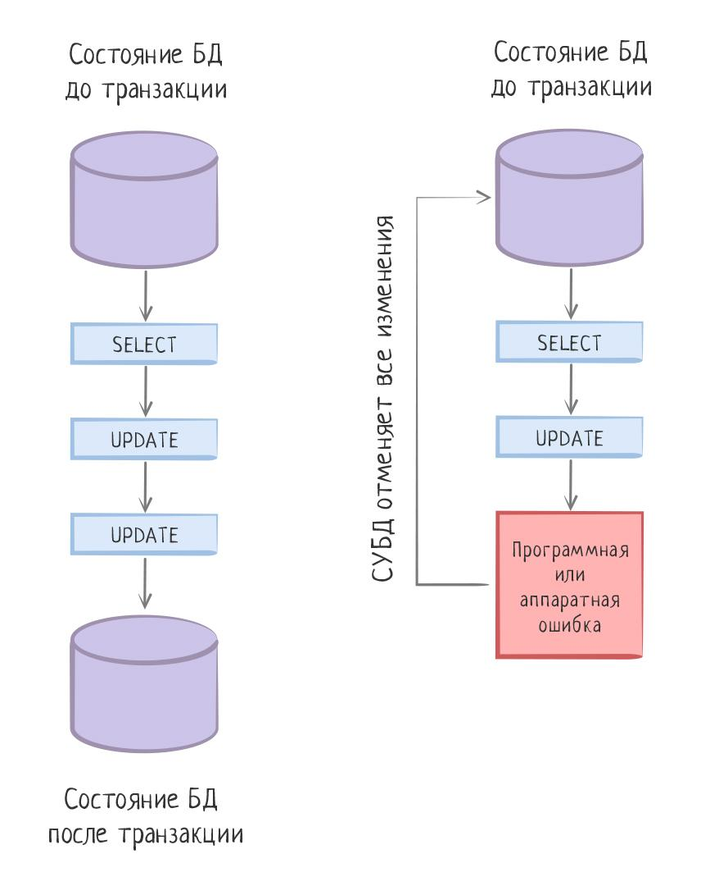

Транзакционность—
Основы реляционных баз данных
Далеко не все операции с базой данных можно выразить одним запросом. Классический пример — перевод денег с одного счета на другой. Допустим, у нас есть таблица счетов accounts, в которой две записи:

id	user_id	amount
1	10	100
2	30	100
Процесс перевода можно грубо (потому что в реальности все гораздо сложнее) представить так:

Получаем количество денег пользователя.

SELECT amount FROM accounts WHERE user_id = 10;
Списываем необходимую сумму со счета этого пользователя.

UPDATE accounts SET amount = amount — 50 WHERE user_id = 10;
Зачисляем деньги другому пользователю:

UPDATE accounts SET amount = amount + 50 WHERE user_id = 30;
В результате этих манипуляций таблица примет следующий вид:

id	user_id	amount
1	10	50
2	30	150
Главная (но не единственная) проблема в этом процессе — отсутствие гарантии завершения. Представьте, что система успела выполнить списание, и в этот момент произошла ошибка, выключили питание, компьютер перезагрузился. В результате получится странная ситуация: деньги списались, но никуда не зачислились:

id	user_id	amount
1	10	50
2	30	100
Подобное поведение недопустимо не только при работе с деньгами, но и в большинстве других ситуаций. Данные приложения, по возможности (в распределенных системах это невозможно, см. CAP-теорему и Eventual Consistency), должны находиться в согласованном состоянии. И добиться этого можно с помощью механизма транзакций. Понятие "транзакция" не является специфичным для баз данных, им пользуются и в обычной жизни. Например, операция снятия денег в банкомате — это бизнес-транзакция. Мы, как пользователи банкомата, ожидаем, что эта операция либо снимет деньги, либо нет, и банкомат это обеспечивает. Но, если копнуть глубже, то станет понятно, что операция снятия денег — это нетривиальный процесс, который приводит не только к множеству запросов в базу данных, но и к затрагиванию нескольких (многих?) систем, у которых свои собственные процессы и базы данных внутри.

Как бы там ни было, главное, что мы ожидаем от любой подобной транзакции — атомарность. С точки зрения пользователя она всегда выглядит, как одна операция, которая либо завершается успешно либо не проходит. Транзакции в базе данных, в этом смысле, значительно проще, чем бизнес-транзакции. За обеспечением необходимых гарантий следит сама СУБД, а не программист:

BEGIN;
SELECT amount FROM accounts WHERE user_id = 10;
UPDATE accounts SET amount = amount — 50 WHERE user_id = 10;
UPDATE accounts SET amount = amount + 50 WHERE user_id = 30;
COMMIT;
Транзакции в PostgreSQL — это блок запросов, обрамленный запросами BEGIN и COMMIT. Первый запрос открывает транзакцию, второй — ее закрывает. Любая ошибка, возникшая внутри транзакции, откатывает целиком все изменения, которые были сделаны после запроса BEGIN. При необходимости, транзакцию можно откатить самостоятельно, выполнив запрос ROLLBACK до COMMIT. Подобное иногда бывает нужно при выполнении запросов из кода приложения.

Согласованность — одно из 4-x требований, которые предъявляются к любым транзакциям. В информатике акроним ACID описывает требования к транзакционной системе (не обязательно базе данных), обеспечивающие наиболее надежную и предсказуемую ее работу. Требования ACID были в основном сформулированы в конце 70-х годов:

Atomicity — Атомарность

Любая транзакция не может быть частично завершена — она либо выполнена, либо нет.

Consistency — Согласованность

Завершившаяся транзакция должна сохранять согласованность базы данных. Другими словами, каждая успешная транзакция по определению фиксирует только допустимые результаты, при том, что в процессе работы транзакции данные могут оказываться не согласованными. В примере выше снятие денег с одного счета приводит к тому, что данные рассинхронизированы, но в момент завершения транзакции этого нет. Гарантия согласованности данных не может быть полностью обеспечена только средствами базы данных (например, различными ограничениями). Поддержка этого свойства включает в себя работу со стороны программистов, которые пишут необходимый для этого код.

Isolation — Изолированность

Во время выполнения транзакции параллельные транзакции не должны оказывать влияния на ее результат. Ни одна транзакция не может увидеть изменения, сделанные другими незавершенными транзакциями. Изолированность — требование дорогое, поэтому в реальных БД существуют режимы, не полностью изолирующие транзакцию (уровни изолированности Repeatable Read и ниже).

Durability — Устойчивость

Независимо от проблем на нижних уровнях (к примеру, обесточивание системы или сбои в оборудовании) изменения, сделанные успешно завершенной транзакцией, должны остаться сохраненными после возвращения системы в работу. Другими словами, если пользователь получил подтверждение от системы, что транзакция выполнена, он может быть уверен, что сделанные им изменения не будут отменены из-за какого-либо сбоя.

Дополнительные материалы
Официальная документация
ACID
Уровни изоляции транзакции